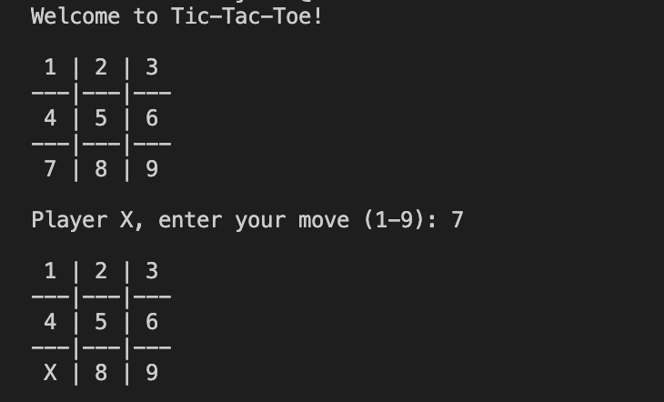

# 🎮 Tic-Tac-Toe in C++



## 📝 Description
A terminal-based implementation of the classic Tic-Tac-Toe game featuring two-player mode with intuitive controls and automatic win/draw detection. Perfect for learning C++ fundamentals including 2D arrays, input validation, and game state management.

## ✨ Features
- 🕹️ Two-player local gameplay (X vs O)
- 🖥️ Clean ASCII interface with numbered grid (1-9)
- ✅ Robust input validation
- ⚡ Instant win/draw detection
- 🔄 Automatic turn management

## 🚀 Quick Start
```bash
# Clone & Play in 3 commands!
git clone https://github.com/your-username/OSTLAB1-TicTacToe.git
cd OSTLAB1-TicTacToe
g++ tictactoe.cpp -o tictactoe
./tictactoe
```

<pre><code> 🎯 How to Play The game board is numbered 1–9 like this: 

    1 | 2 | 3 
   ---+---+--- 
    4 | 5 | 6 
   ---+---+--- 
    7 | 8 | 9  

- Player `X` goes first. 
- Players take turns entering a number (1–9) to place their symbol (`X` or `O`) in the corresponding square. 
- The move is **validated**: no overwriting allowed. 
- The game automatically checks for: 
- ✅ Win (3 in a row – horizontal, vertical, or diagonal) 
- 🔁 Draw (all spaces filled with no winner) 
- A message is displayed when a player wins or the game ends in a draw. </code></pre>
